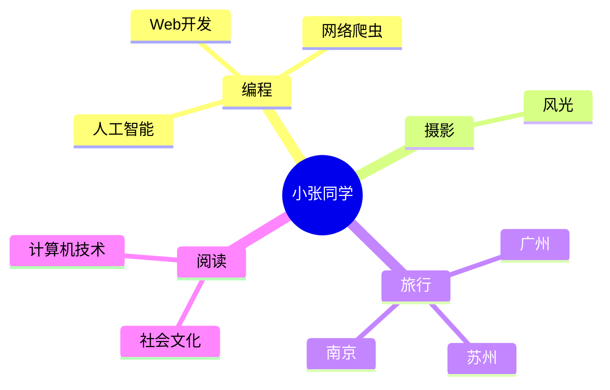

### Hi there 👋

<!--
**zbbalan/zbbalan** is a ✨ _special_ ✨ repository because its `README.md` (this file) appears on your GitHub profile.

Here are some ideas to get you started:

- 🔭 I’m currently working on ...
- 🌱 I’m currently learning ...
- 👯 I’m looking to collaborate on ...
- 🤔 I’m looking for help with ...
- 💬 Ask me about ...
- 📫 How to reach me: ...
- 😄 Pronouns: ...
- ⚡ Fun fact: ...
-->


  <!-- knock code pictures 敲代码的图片 -->
  <br>

  


<!-- Snake Code Contribution Map 贪吃蛇代码贡献图 -->
<picture>
  <source media="(prefers-color-scheme: dark)" srcset="https://cdn.jsdelivr.net/gh/sun0225SUN/sun0225SUN/profile-snake-contrib/github-contribution-grid-snake-dark.svg" />
  <source media="(prefers-color-scheme: light)" srcset="https://cdn.jsdelivr.net/gh/sun0225SUN/sun0225SUN/profile-snake-contrib/github-contribution-grid-snake.svg" />
  
</picture>

</div>

#  🙋 Hello

<table>
<tr><td>

<!-- About me 关于我 -->
### 🤺 About Me


<p>&emsp;&emsp;大家好，我是张波波同学。</p>
<p>&emsp;&emsp;热爱编程、摄影、读书、旅行。</p>
<p>&emsp;&emsp;热爱计算机科学和IT互联网事业，励志成为一名优秀的开发者。</p>
<p>&emsp;&emsp;我们正在让这个世界变得更加美好，通过代码的重复使用和延展构建完美体系。</p>
<p><strong>&emsp;&emsp;We're making the world a better place. Through constructing elegant hierarchies for maximum code reuse and extensibility.</strong></p>

</td></tr>

<tr></tr>


<tr><td>

<!-- wakatime 统计 -->
### 📊 WakaTime

<picture>
  <source
    srcset="https://github-readme-stats.vercel.app/api/wakatime?username=sun0225SUN&layout=compact&text_color=f0f6fc&bg_color=00000000&hide_border=true&hide_title=true"
    media="(prefers-color-scheme: dark)"
  />
  <source
    srcset="https://github-readme-stats.vercel.app/api/wakatime?username=sun0225SUN&layout=compact&text_color=1f2328&bg_color=00000000&hide_border=true&hide_title=true"
    media="(prefers-color-scheme: light), (prefers-color-scheme: no-preference)"
  />
  
</picture>

</td></tr>

<tr><td>

<!--START_SECTION:waka-->
**I'm an Early 🐤** 

```text
🌞 Morning                550 commits         ██████░░░░░░░░░░░░░░░░░░░   25.00 % 
🌆 Daytime                704 commits         ████████░░░░░░░░░░░░░░░░░   32.00 % 
🌃 Evening                642 commits         ███████░░░░░░░░░░░░░░░░░░   29.18 % 
🌙 Night                  304 commits         ███░░░░░░░░░░░░░░░░░░░░░░   13.82 % 
```
📅 **I'm Most Productive on Friday** 

```text
Monday                   261 commits         ███░░░░░░░░░░░░░░░░░░░░░░   11.86 % 
Tuesday                  195 commits         ██░░░░░░░░░░░░░░░░░░░░░░░   08.86 % 
Wednesday                312 commits         ████░░░░░░░░░░░░░░░░░░░░░   14.18 % 
Thursday                 259 commits         ███░░░░░░░░░░░░░░░░░░░░░░   11.77 % 
Friday                   662 commits         ████████░░░░░░░░░░░░░░░░░   30.09 % 
Saturday                 187 commits         ██░░░░░░░░░░░░░░░░░░░░░░░   08.50 % 
Sunday                   324 commits         ████░░░░░░░░░░░░░░░░░░░░░   14.73 % 
```


📊 **This Week I Spent My Time On** 

```text
🕑︎ Time Zone: Asia/Shanghai

💬 Programming Languages: 
python                   20 hrs 56 mins      ███████████████████░░░░░░   74.31 % 
Markdown                 2 hrs 46 mins       ██░░░░░░░░░░░░░░░░░░░░░░░   09.86 % 
linux                    1 hr 14 mins        █░░░░░░░░░░░░░░░░░░░░░░░░   04.43 % 

🔥 Editors: 
VS Code                  26 hrs 52 mins      ████████████████████████░   95.38 % 
Obsidian                 56 mins             █░░░░░░░░░░░░░░░░░░░░░░░░   03.35 % 
IntelliJ                 21 mins             ░░░░░░░░░░░░░░░░░░░░░░░░░   01.27 % 

💻 Operating System: 
Mac                      22 hrs 16 mins      ████████████████████░░░░░   79.04 % 
Windows                  5 hrs 54 mins       █████░░░░░░░░░░░░░░░░░░░░   20.96 % 
```


 Last Updated on 18/08/2023 01:09:08 UTC
<!--END_SECTION:waka-->

</td></tr>
</table>

<!-- ########################################## 分割 ########################################## -->


<div align="center" >



<!-- just img 图片 -->


<!--  skill badge 技能徽章 -->
💪 正在学习


​                                                                                                     
​                                                                                                     
​                                                                                                     

🧰 常用的工具


<!-- programming tool icon 编程工具图标 -->
<br>


</div>
